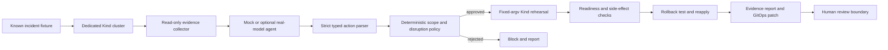

# Architecture

The simulator replaces Kind and the executor with in-memory state. It can deliberately execute unsafe comparator behavior there, with no Kubernetes credentials or shell access. Each approach receives the same fixture evidence. The real-model adapter is used only by the guarded path and its output passes through the same parser and policy.

### Modules

| Module | Responsibility |
|---|---|
| `incidents.py` | Fault definitions, causes, and recovery oracles |
| `kind.py` | Dedicated cluster setup, injection, evidence, fixed actions, rehearsal |
| `simulation.py` | Offline fixture state and no-shell comparative execution |
| `agent.py` | Deterministic mock and optional Responses API adapter |
| `models.py` | Strict action and evidence types |
| `policy.py` | Scope, evidence, revision, and disruption validation |
| `evaluation.py` | Comparable repeated trials and metrics |
| `report.py` | Evidence files and reviewable GitOps patch |

The policy reads structured status, revision, and resource signals. It does not treat log prose as an authorization source. A production integration would need a separate, reviewed system; this repository intentionally has no production execution adapter.
